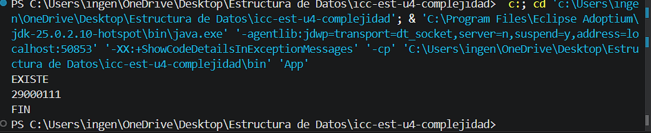

# Práctica: 04.01 Complejidad Proyecto JAVA

## Datos del Estudiante
- **Nombre:** Angelo Carchipulla
- **Curso:** Estructura de Datos G2
- **Fecha:** 14/03/2026

---

## 1. icc-est-u4-complejidad

**Fecha:** 14/03/2026

**Descripción:** Creamos el proyecto y subimos a github

## 2. icc-est-u4-complejidad

**Fecha:** 15/03/2026

**Descripción:** Creamos la clase Estudiante y Generador y creamos un listado de estudiantes aleatorios para buscar y optimizar la búsqueda.